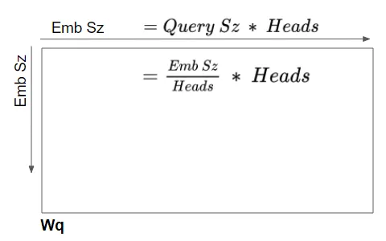
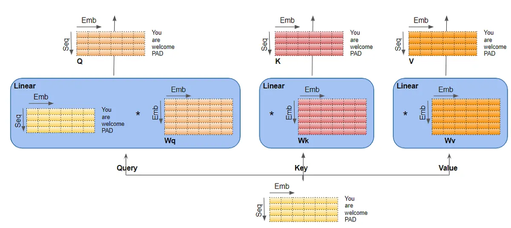
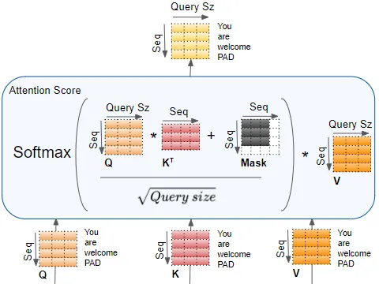
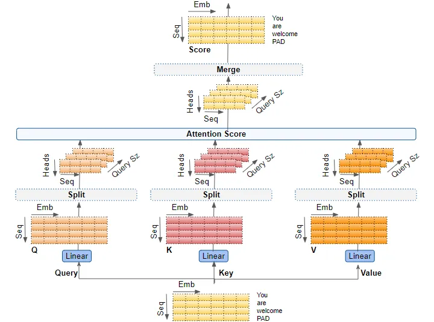
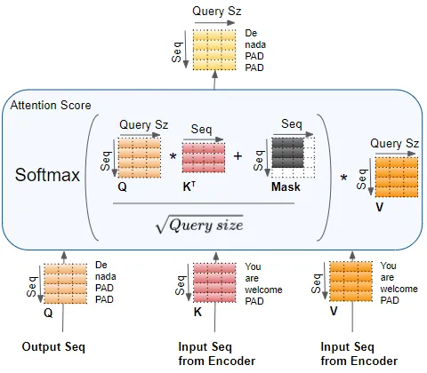
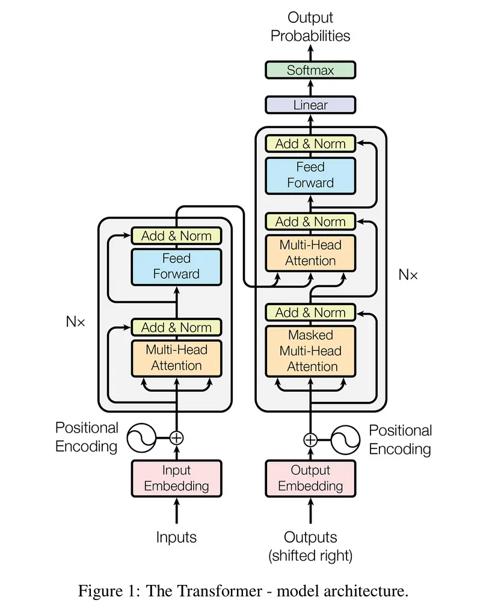

## Background

Twitter has become an important communication channel in times of emergency.

The ubiquitousness of smartphones enables people to announce an emergency they’re observing in real-time. Because of this, more agencies are interested in programatically monitoring Twitter (i.e. disaster relief organizations and news agencies).

But, it’s not always clear whether a person’s words are actually announcing a disaster. Take this example:

The author explicitly uses the word “ABLAZE” but means it metaphorically. This is clear to a human right away, especially with the visual aid. But it’s less clear to a machine.

In this competition, we’re challenged to build a machine learning model that predicts which Tweets are about real disasters and which one’s aren’t.

## Motivation

I have always know various ML NLP algorithms, but haven't used them in a real dataset outside of a classroom setting. When I saw this competitioni in Kaggle, I thought it would be a great opportunity for me to read the original paper and online resources about and deepen my understanding of the model behind recent LLM(Large Language Model), the Tranformer model, and learn to implement and customize it for this specific task.

## How Transformer Works

For this competition, I started by researching and understanding the details of the Transformer architecture. The most important component of this architecture is the multihead attention mechanism.

The mechanism takes its input in the form of three parameters, known as Query(Q), Key(K) and Value(V). They come in the format of matrices, and the main idea is drawn from informtation retrieval. For example, if you are searching for YouTube videos, and put in a few key words(Q), the search engine look for similar tag words(K), and return videos(V) associated with those tags. This QKV system is the backbone of the Transformer architecture. One block component using the attention mechanism will essentially multiply Q with a weight matrix Wq, similarly K with Wk, V with Wk, and them together, withsome normalization and non-linearity.

The encoder takes the input sentence embedding as all three, Q, K, and V. The intuition is that this allows each words in the sentence pay attention to each other words in the same sentence, and thus learn their meaning relative to each other within the sentence. Essentially, it calculate an attention score for the input, which gets incorporated in the decoder to calculate a loss function. This self attention block is stacked 6 times.

For the decoder, one same block of self-attention is used with the output embedding as Q, K and V. Then, it goes through an Add & Norm layer. This layer add the attention scores calculated by the previous layer, which in this case is the word embedding, and normalize the layer. Add & Norm layers follow every attention block and linear block in this architecture. After the Add & Norm layer is an encoder-decoder, where Q is the output self-attention score from the Add & Norm layer, and K and V are input sequence from the encoder. The intuition is that this layer calculates the attention score when the target sentence is paying attention to the input sentence. It captures how each words in the input sentence interact with words in the target sentence.

Here is the full architecture:

To use Transformer model to perform machine translation, we just feed a Start-Of-Sentence marker(<SOS>) to the model at the start, and incrementally predict the next word based on the output of the previous word(s).

In helping me achieve these understandings, [this](https://towardsdatascience.com/transformers-explained-visually-part-3-multi-head-attention-deep-dive-1c1ff1024853) medium article and [this](<https://kikaben.com/transformers-encoder-decoder/#:~:text=The%20transformer%20uses%20an%20encoder,an%20output%20sentence%20(translation).>) article helped me tremendiously. And most of the diagrams are from the medium article -- a huge thanks for helping me understand the exact dimensions of all the variables.

## The Program

Once I felt like I understood how Transformer works, I just want to test it out and see it in action. First we need to do some simple exploring and preprocessing, but I want to minimize this and get to the training stage quickly. I took a look at some of the tweets, and processed them by concatenating the location and keyword attribute in the end of the sentence if non-null. There are so many more ways I can preprocess the data better, including stripping stop words, numbers, HTML tags, punctuations and others, and converting to lower case. I left it as it is for now.

Then I mostly followed [this amazing tutorial](https://blog.paperspace.com/transformers-text-classification/) to implement a pre-trained Transformer model. The challenge is to adopt the tutorial to this use case. The first difference is the data source. In the tutorial the author imported data from the tfds library, which I think is a variation of Dataset type in Tensorflow that is not directly accessible and need to use library functions like next() and batch(), where as my data is a dataframe loaded from csv. I have to figure out the correct way to convert a dataframe to the correct Dataset type, which took me a relatively long time. Moreover, the conversion needs to happen to not only the training dataset, but also the testing dataset. Thus, when predicting, I need to call `model.predict(test_data.batch(1))` instead of `model.predict(test_data)`, which is a little ugly but get the work done. Finally, a sigmoid function is applied to the predictions, so that the predictions falls between 0 and 1, and I used `round()` to map them to 0 and 1, which is the final prediction.

## Result

Without any further customized fine-tuning and data preprocessing, the model acheived an accuracy score of 0.7634 on the test dataset. In the training set, there are 4342 0 target values, and 3271 1 target values, so 57.03% tweets are not real disaster tweets, and 42.97% tweets are. The expected accuracy of a random guesser is `0.5703 * 0.5703 + 0.4297 * 0.4297 = 0.3252 + 0.1846 ~= 0.51`. So my classifier is a little more than a quarter more possible to predict correctly.

## Future Steps

I want to work on it a bit more in the future to explore text data preparation and handmaking a Transformer model. Following a different section of the above mentioned article and other notebooks should serve as a good first step.

The pre-contest research, learning about Tensorflow and making sense of the data type took the most time. I feel like I learned a lot from this project, and hope you enjoyed my blog too! Feel free to comment if you have any thoughts.

## Source Code

[Kaggle](https://www.kaggle.com/code/tianyimasf/real-disaster-tweets-prediction-with-transformer) [Github](https://github.com/tianyimasf/kaggle/blob/main/real-disaster-tweets-prediction-with-transformer.ipynb)
