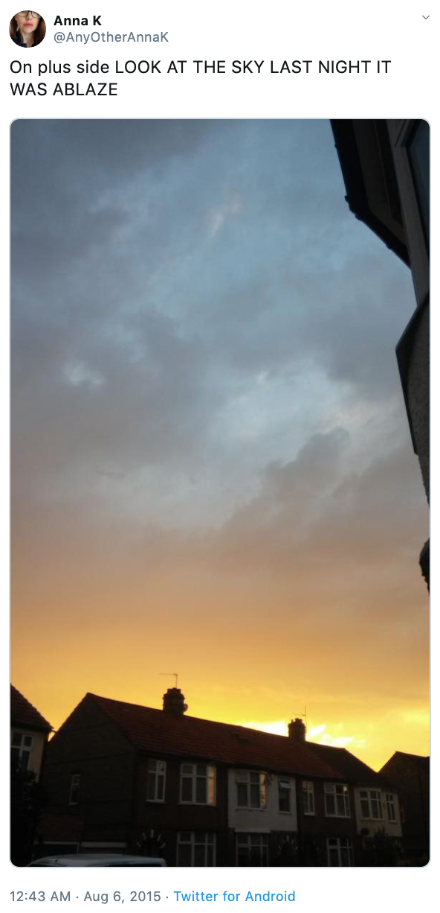

## Background

Twitter has become an important communication channel in times of emergency.

The ubiquitousness of smartphones enables people to announce an emergency they’re observing in real-time. Because of this, more agencies are interested in programatically monitoring Twitter (i.e. disaster relief organizations and news agencies).

But, it’s not always clear whether a person’s words are actually announcing a disaster. Take this example:

The author explicitly uses the word “ABLAZE” but means it metaphorically. This is clear to a human right away, especially with the visual aid. But it’s less clear to a machine.

In this competition, we’re challenged to build a machine learning model that predicts which Tweets are about real disasters and which one’s aren’t.

## Motivation

I have always know various ML NLP algorithms, but haven't used them in a real dataset outside of a classroom setting. When I saw this competitioni in Kaggle, I thought it would be a great opportunity for me to read the original paper and online resources about and deepen my understanding of the model behind recent LLM(Large Language Model), the Tranformer model, and learn to implement and customize it for this specific task.
