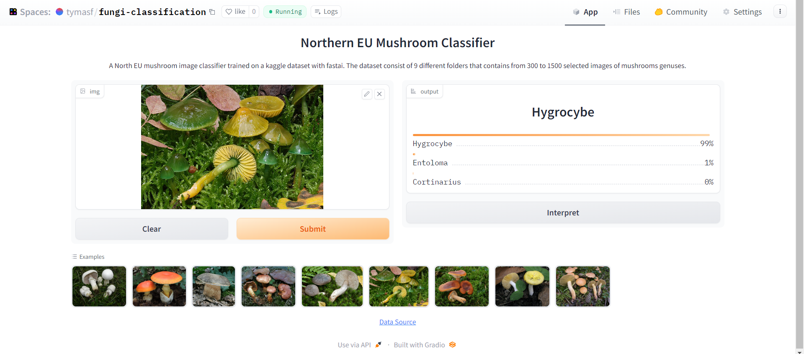

_**Full Stack Deep Learning: Project Deep Shroom| May, 2023 | [Kaggle Notebook (train & save model)](https://www.kaggle.com/tianyimasf/deep-shroom-classification-using-fast-ai)**_

Using fast.ai, trained a ResNet18 model on a Kaggle dataset consists of 9 different folders that contains from 300 to 1500 selected images of corresponding mushrooms genuses, labels indicated by folder names. Deployed and published using Gradio on Hugging Face: [click here](https://huggingface.co/spaces/tymasf/fungi-classification). Achieved accuracy of 0.8323 and near perfect top 3 accuracy of 0.9627.
