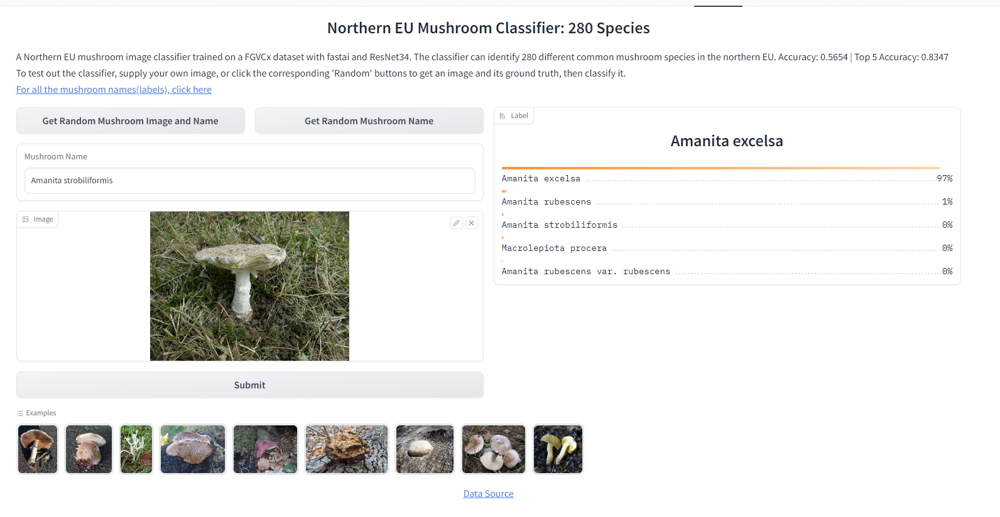
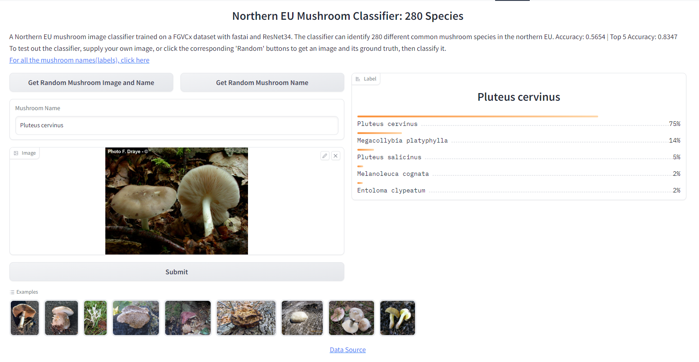

_**Project Deep Shroom Returns (with 280 different species!) | 2023.06.03 | [Full Code](https://huggingface.co/spaces/tymasf/fungi-classification-280-species/tree/main)**_

Using Python and fast.ai, pre-processed and trained a ResNet34 model on a FGVCx dataset with 280 different mushroom species and around 45,000 different mushroom images, labels indicated by folder names. Deployed and published using Gradio on Hugging Face: [click here](https://huggingface.co/spaces/tymasf/fungi-classification-280-species), specifically its "Block" concept that is more complicated but more flexible than "Interface". Achieved Accuracy: 0.5654 | Top 5 Accuracy: 0.8347.
