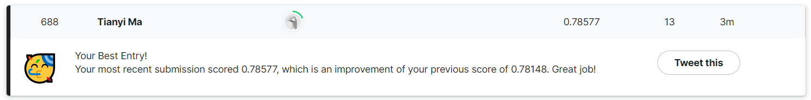

_**Real Disaster Tweets Prediction, Kaggle | Mar, 2023 | [Kaggle Notebook](https://www.kaggle.com/code/tianyimasf/real-disaster-tweets-prediction-with-transformer) | [Github](https://github.com/tianyimasf/kaggle/blob/main/real-disaster-tweets-prediction-with-transformer.ipynb)**_

Twitter has become an important communication channel in times of emergency.

The ubiquitousness of smartphones enables people to announce an emergency they’re observing in real-time. Because of this, more agencies are interested in programatically monitoring Twitter (i.e. disaster relief organizations and news agencies).

But, it’s not always clear whether a person’s words are actually announcing a disaster. Take this example:

The author explicitly uses the word “ABLAZE” but means it metaphorically. This is clear to a human right away, especially with the visual aid. But it’s less clear to a machine.

In this competition, we’re challenged to build a machine learning model that predicts which Tweets are about real disasters and which one’s aren’t.

If you are interested in further documentation, I have a blog detailed [my solution](/pages/article/1.html) to this problem.
