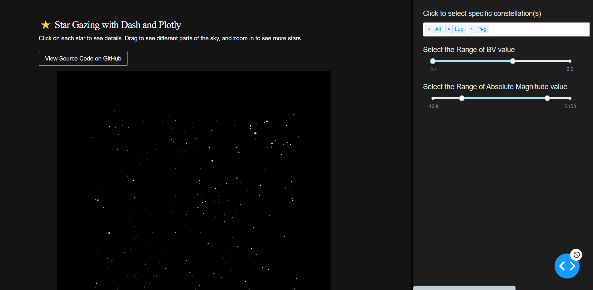

_**3D Visualzation of Stars ⭐ in Our Universe | Mar - May, 2023**_

[The visualization](https://stargazingnight.herokuapp.com/) randomly samples 6k stars in our universe and plot them in 3D with their coordinates, absoulte magnitude (radius) and temperature (color). You can play around with the visualization. Dummy filters were recently added and will be actually implemented soon.

(https://stargazingnight.herokuapp.com/) | [Github](https://github.com/tianyimasf/star-gaze)