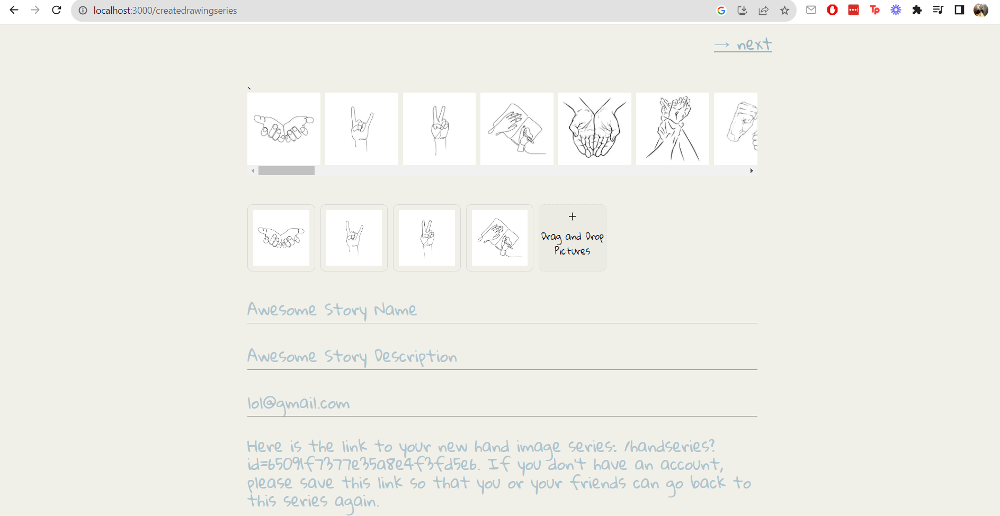

_**Online Art Game: Story of Hands (IN PROGRESS) | July, 2023 | [Source_Code](https://github.com/tianyimasf/story-of-hands)**_

[hand_series](../images/hand_series.PNG)

[submit_story](../images/submit_story.PNG)

An engaging online art game, enabling users to connect with family, friends, and strangers. An intuitive interface for players to guess the story behind a curated collection of hand gesture pictures, fostering creativity and imagination. Utilized TypeScript, React, NodeJS, and MongoDB to create and implement the game, enhancing user experience and fostering meaningful interactions.
