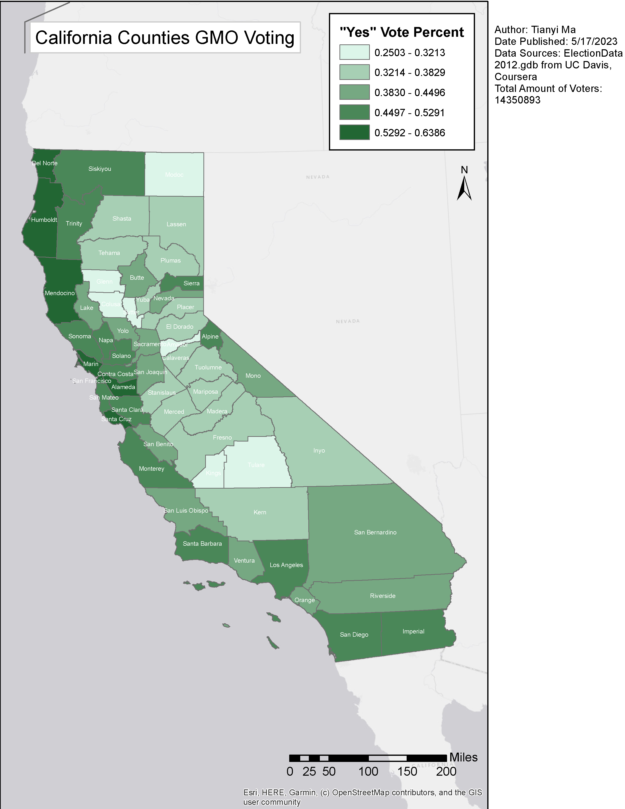

_**Tableau & ArcGIS Visualizations | March - May, 2023**_

This page is dedicated to various visualizations I made through my journey learning DS.

The above is FB social network visualizations for 3000 anonymous users, created using Tableau.

This is a time series visualization of world temperature mean at wet seasons(DJF, MAM) from 1880 to 2015, created using Tableau.

Through the GIS course from US Davis on Coursera, I made my first map using ArcGIS.

A map plotting the percentages of yes votes for each California county for the ballot measure that requires Genetically Modified Organism labeling.
