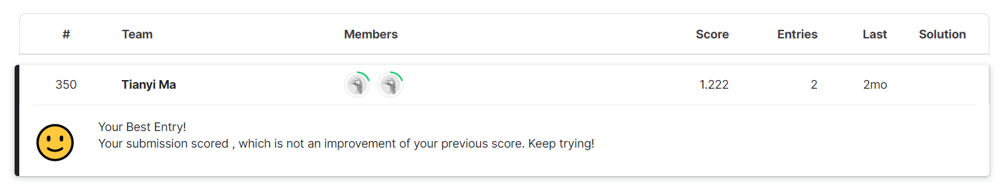
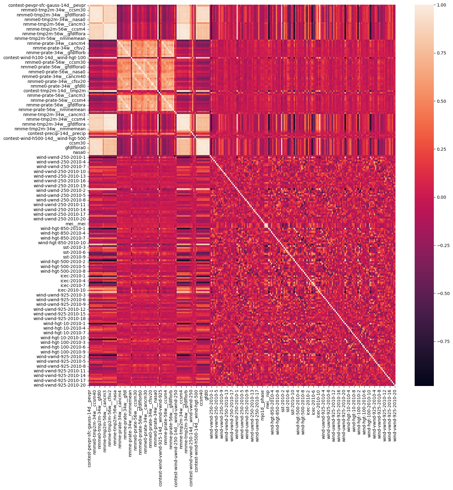

_**Weather Forcasting (Kaggle, WiDS Datathon) | Mar, 2023 | [Kaggle Notebook](https://www.kaggle.com/code/tianyimasf/wids-datathon-tianyi-yukyung-and-irsa) | [Github](https://github.com/tianyimasf/kaggle/blob/main/wids-datathon-tianyi-yukyung-and-irsa.ipynb)**_

The WiDS Datathon 2023 focuses on a prediction task involving forecasting sub-seasonal temperatures (temperatures over a two-week period, in our case) within the United States. They used a pre-prepared dataset consisting of weather and climate information for a number of US locations, for a number of start dates for the two-week observation, as well as the forecasted temperature and precipitation from a number of weather forecast models. Each row in the data corresponds to a single location and a single start date for the two-week period. My task is to predict the arithmetic mean of the maximum and minimum temperature, for each location and start date.

If you are interested in further documentation, I have a blog detailed [my solution](/article/0.html) to this problem.
